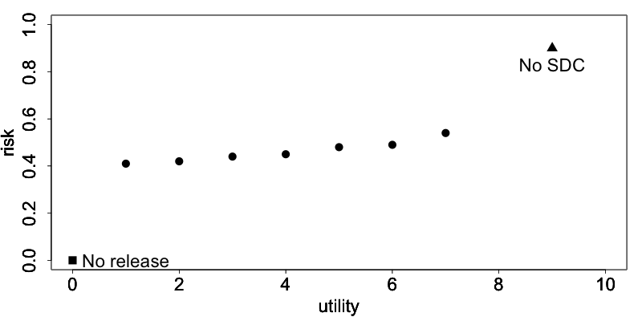
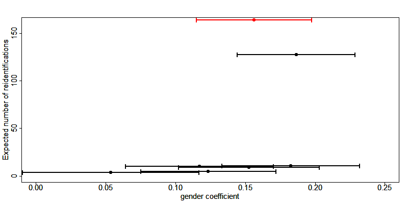
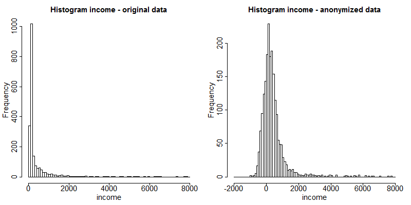
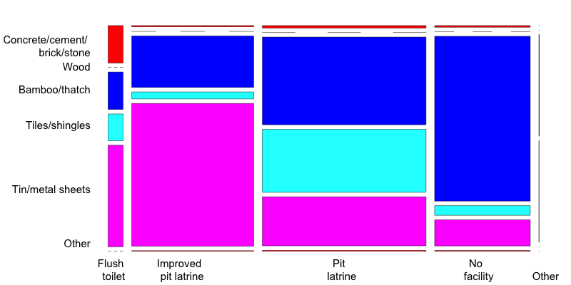

Measuring Utility and Information Loss
======================================

SDC is a trade-off between risk of disclosure and loss of data utility
and seeks to minimize the latter, while reducing the risk of disclosure
to an acceptable level. Data utility in this context means the
usefulness of the anonymized data for statistical analyses by end users
as well as the validity of these analyses when performed on the
anonymized data. Disclosure risk and its measurement are defined in
the Section `Measure Risk <measure_risk.html>`__ of this guide. 
In order to make a trade-off between minimizing
disclosure risk and maximizing utility of data for end users, it is
necessary to measure the utility of the data after anonymization and
compare it with the utility of the original data. This section describes
measures that can be used to compare the data utility before and after
anonymization, or alternatively quantify the information loss.
Information loss is the inverse of data utility: the larger the data
utility after anonymization, the smaller the information loss. 

.. NOTE::
	If the microdata to be anonymized is based on a sample, the data will incur
	a sampling error. Also other errors may be present in the data, such as
	nonresponse error. 

.. NOTE:: 
	The methods discussed here only measure the 
	information loss caused by the anonymization process relative to the
	original sample data and do not attempt to measure the error caused by
	other sources.

Ideally, the information loss is evaluated with respect to the needs and
uses of the end users of the microdata. However, different end users of
anonymized data may have very diverse uses for the released data and it
might not be possible to collect an exhaustive list of these uses. Even
if many uses can be identified, the characteristics in the data needed
for these uses can be contradictory (e.g., one user needs a detailed
geographical level whereas another is interested in a detailed age
structure and does not need a detailed geographical structure).
Nevertheless, as pointed out earlier, only one anonymized dataset can be
released for each dataset and every type of release to avoid unintended
disclosure. Releasing multiple anonymized datasets for different
purposes may lead to unintended disclosure. [#foot58]_
Therefore, it is not possible to anonymize and release a file tailored
to each user’s needs.

Since collecting and taking into account all data uses is often
impossible, we also look at general (or generic) information loss
measures besides user- and data-specific information loss measures.
These measures do not take into account the specific data use, but can
be used as guiding measures for information loss and evaluating whether
a dataset is still analytically valid after anonymization. The main idea
for such measures is to compare records between the original and treated
datasets and compare statistics computed from both datasets (`HDFG12`_). 
Examples of such measures are the number of suppressions,
number of changed values, changes in contingency tables and changes in
mean and covariance matrices.

Many of the SDC methods discussed earlier are parametric, in the sense
that their outcome depends on parameters chosen by the user. Examples
are the cluster size for microaggregation (see the Section 
`Microaggregation <anon_methods.html#Microaggregation>`__) or the
importance vector in local suppression (see the Section 
`Local suppression <anon_methods.html#Local suppression>`__). Data utility
and information loss measures are useful for choosing these parameters
by comparing the impact of different parameters on the information loss.
:numref:`fig61` illustrates this by showing the trade-off between the
disclosure risk and data utility of a hypothetical dataset. The triangle
represents the original data with full utility and a certain level of
disclosure risk, which is too high for disclosure. The square represents
no release of microdata. Although there is no risk of disclosure, there
is also no utility from the data for users since no data is released.
The points in between represent the result of applying different SDC
methods with different parameter specifications. We would select the SDC
method corresponding to the point, which maximizes the utility, while
keeping disclosure risk at an acceptable level.

.. _fig61:

   
   The trade-off between risk and utility in a hypothetical dataset

In the following sections, we first propose general utility measures
independent of data use, and later present an example of a specific
measure useful to measure information loss with respect to specific data
uses. Finally, we show how to visualize changes in the data caused by
anonymization and discuss the selection of utility measures for a
particular dataset.

General utility measures for continuous and categorical variables
-----------------------------------------------------------------

General or generic measures of information loss can be divided into
those comparing the actual values of the raw and anonymized data, and
those comparing statistics from both datasets. All measures are a
posteriori, since they measure utility after anonymization and require
both the data before and after the anonymization process. General
utility measures are different for categorical and continuous variables.

General utility measures for categorical variables
~~~~~~~~~~~~~~~~~~~~~~~~~~~~~~~~~~~~~~~~~~~~~~~~~~

Number of missing values
^^^^^^^^^^^^^^^^^^^^^^^^

An informative measure is to compare the number of missing values in the
data. Missing values are often introduced after suppression and more
suppressions indicate a higher degree of information loss.
More generally, it is possible to count and compare the number of
missing values in the original data and the treated data. This can be
useful to see the proportional increase in the number of missing values.
Missing values can also have other sources, such as nonresponse. 

Number of records changed
^^^^^^^^^^^^^^^^^^^^^^^^^

Another useful statistic is the number of records changed per variable.
The number of records changed gives a good indication of the impact of the
anonymization methods on the data. 

Comparing contingency tables
^^^^^^^^^^^^^^^^^^^^^^^^^^^^
	
A useful way to measure information loss in categorical variables is to
compare univariate tabulations and, more interestingly, contingency
tables (also cross tabulations or two-way tables) between pairs of
variables. To maintain the analytical validity of a dataset, the
contingency tables should stay approximately the same. 

`DoTo01b`_ propose a Contingency Table-Based
Information Loss (CTBIL) measure, which quantifies the distance between
the contingency tables in the original and treated data. Alternatively,
visualizations of the contingency table with mosaic plots can be used to
compare the impact of anonymization methods on the tabulations and
contingency tables (see the Section `Mosaic plots`_).

General utility measures for continuous variables
~~~~~~~~~~~~~~~~~~~~~~~~~~~~~~~~~~~~~~~~~~~~~~~~~

Statistics: mean, covariance, correlation
^^^^^^^^^^^^^^^^^^^^^^^^^^^^^^^^^^^^^^^^^

The statistics characterizing the dataset should not change after the
anonymization. Examples of such statistics are the mean, variance, and
covariance and correlation structure of the most important variables in
the dataset. Other statistics characterizing the data include the
principal components and the loadings. `DoTo01b`_
give an overview of statistics that can be considered. In order to
evaluate the information loss caused by the anonymization, one should
compare the appropriate statistics for continuous variables computed
from the data before and after anonymization. There are several ways to
evaluate the loss of utility with respect to the changes in these
statistics, for instance, by comparing means and (co-)variances in the
data or comparing the (multivariate) distributions of the data.
Especially changes in the correlations gives valuable information on the
validity of the data for regressions. 

`DoTo01b`_ propose several measures for the
discrepancy between the covariance and correlation matrices. These
measures are based on the mean squared error, the mean absolute error or
the mean variation of the individual cells. We refer to `DoTo01b`_ for a complete overview of these measures.

IL1s information loss measure 
^^^^^^^^^^^^^^^^^^^^^^^^^^^^^^

Alternatively, we can also compare the actual data and quantify the
distance between the original dataset :math:`X` and the treated dataset
:math:`Z`. Here :math:`X` and :math:`Z` contain only continuous
variables. `YaWC02`_ introduce the distance
measure IL1s, which is the sum of the absolute distances between the
corresponding observations in the raw and anonymized datasets, which are
standardized by the standard deviation of the variables in the original
data. For the continuous variables in the dataset, the IL1s measure is
defined as

.. math:: IL1s = \frac{1}{\text{pn}}\sum_{j = 1}^{p}{\sum_{i = 1}^{n}\frac{\left| x_{\text{ij}} - z_{\text{ij}} \right|}{\sqrt{2}S_{j}}},

where :math:`p` is the number of continuous variables; :math:`n` is the
number of records in the dataset; :math:`x_{\text{ij}}` and
:math:`z_{\text{ij}}`, respectively, are the values before and after
anonymization for variable :math:`j` and individual :math:`i`; and
:math:`S_{j}` is the standard deviation of variable :math:`j` in the
original data (`YaWC02`_).

The measure is useful for comparing different methods. The smaller the
value of the measure, the closer the values are to the original values
and the higher the utility. 

.. NOTE::
	This measure is related to risk measures based on distance and intervals (see 
	the Section `Risk measures for continuous variables <measure_risk.html#Risk measures for continuous variables>`__). 

The greater the distance between the original and anonymized values, the
lower the data utility. Greater distance, however, also reduces the risk
of re-identification.

Eigenvalues
^^^^^^^^^^^

Another way to evaluate the information loss is to compare the robust
eigenvalues of the data before and after anonymization. Again, the main use is to compare different methods. The greater the
value, the greater the changes in the data and the information loss.

Utility measures based on the end user’s needs
----------------------------------------------

Not all needs and uses of a certain dataset can be inventoried.
Nevertheless, some types of data have similar uses or important
characteristics, which can be evaluated before and after anonymization.
Examples of such “benchmarking indicators” (`TMKC14`_) are
different for each dataset. Examples include poverty measures for income
datasets and school attendance ratios. Often ideas for selecting such
indicators come from the reports data users publish based on previously
released microdata.

The approach is to compare the indicators calculated on the untreated
data and the data after anonymization with different methods. If the
differences between the indicators are not too large, the anonymized
dataset can be released for use by researchers. It should be taken into
account that indicators calculated on samples are estimates with a
certain variance and confidence interval. Therefore, for sample data, it
is more informative to compare the overlap of confidence intervals
and/or to evaluate whether the point estimate calculated after
anonymization is contained within the confidence interval of the
original estimate. Examples of benchmark indicators and their confidence
intervals are included in the case
studies in these guidelines. Here we give the example of the GINI
coefficient.

The GINI coefficient is a measure of statistical dispersion, which is
often used to measure inequality in income. A way to measure the
information loss in income data is to compare the income distribution,
which can be easily done by comparing the GINI coefficients. The GINI
coefficient of sample data is a random variable. Therefore, it is useful
to construct a confidence interval around the coefficient to evaluate
the significance of any change in the coefficient after anonymization.

Regression 
-----------

Besides comparing covariance and correlation matrices, regressions are a
useful tool to evaluate whether the structure in the data is maintained
after anonymization. By comparing regressions parameters, it is also
possible to compare relations between non-continuous variables (e.g., by
introducing dummy variables or regression with ordinal variables). If it
is known for what purpose and in what field the data is used, common
regressions can be used to compare the change in coefficients and
confidence intervals.

An example of using regression to evaluate the data utility in income
data is the Mincer equation. The Mincer equation explains earnings as a
function of education and experience while controlling for other
variables. The Mincer equation is often used to evaluate the gender pay
gap and gender wage inequality by including a gender dummy. Here we show
how to evaluate the impact of anonymization methods on the gender
coefficient. We regress the log income on a constant, a gender dummy,
years of education, years of experience, years of experience squared and
other factors influencing wage.

.. math:: \ln\left( \text{wage} \right) = \beta_{0} + \beta_{1}gender + \beta_{2}education + \beta_{3}experience + \beta_{3}\text{experience}^{2} + \beta X

The parameter of interest here is :math:`\beta_{1}`, the effect of
gender on the log wage. X is a matrix with several other factors
influencing wage and :math:`\beta` the coefficients of these factors.

If the new estimates fall within the original confidence interval and
the new and original confidence intervals are greatly overlapping, the
data can be considered valid for this type of regression after
anonymization. :numref:`fig62` shows the point estimates and confidence
intervals for the gender coefficient in this trade-off for a sample
income dataset and several SDC methods and parameters. The red dot and
confidence bar (on the top) correspond to the estimates for the
untreated data, whereas the other confidence bars correspond to the
respective SDC methods and different parameters. The anonymization
reduces the number of expected re-identifications in the data (left
axis) and the point estimates and confidence intervals vary greatly for
the different SDC methods. We would choose a method, which reduces the
expected number of identifications, while not changing the gender
coefficient and having a great overlap of the confidence interval with
the confidence interval estimated from the original data.

.. _fig62:

   
   Effect of anonymization on the point estimates and confidence interval of the gender coefficient in the Mincer equation

Assessing data utility with the help of data visualizations
-----------------------------------------------------------

The use of graphs and other visualization techniques is a good way to
assess at a glance how much the data have changed after anonymization,
and can aid the selection of appropriate anonymization techniques for
the data. Visualizations can be a useful tool to assess the impact on
data utility of anonymization methods and helps choose among
anonymization methods. The software package *R* provides several
functions and packages that can help visualize the results of
anonymization. This section provides a few examples. We
present the following visualizations:

-  histograms and density plots

-  boxplots

-  mosaic plots

To make appropriate visualizations, we need to use the raw data and the
anonymized data.

Histograms and density plots
~~~~~~~~~~~~~~~~~~~~~~~~~~~~

Histograms and density plots are useful for quick comparisons of
variable distribution before and after anonymization. The advantage of
histograms is that the results are exact. Visualization depends on the
bin widths and the start point of the first bin, however. Histograms can
be used for continuous and semi-continuous variables. Density plots
display the kernel density of the data; therefore, the plot depends on
the kernel that is chosen and whether the data fits the kernel well.
Nevertheless, density plots are a good tool to illustrate the change of
values and value ranges of continuous variables.

:numref:`fig63` and :numref:`fig64` show examples. The histograms and density plots give a clear
indication how the values have changed: the variability of the data has
increased and the shape of the distribution has changed. 

.. NOTE:: 
	The vertical axes of the histograms have different scales.

.. _fig63:

   
   Histograms of income before and after anonymization

.. _fig64:

.. figure:: media/image14.png
   :align: center
   
   Density plots of income before and after anonymization

Box plots
~~~~~~~~~

Box plots give a quick overview of the changes in the spread and
outliers of continuous variables before and after anonymization. 
:numref:`fig65` shows an example for an expenditure variable
after adding noise. The box plot shows clearly that the variability in
the expenditure variable increased as a result of the anonymization
methods applied.

.. _fig65:

.. figure:: media/image15.png
   :align: center
   
   Example of box plots of an expenditure variable before and after anonymization

Mosaic plots
~~~~~~~~~~~~

Univariate and multivariate mosaic plots are useful for showing changes
in the tabulations of categorical variables, especially when comparing
several “scenarios” next to one another. A scenario here refers to the
choice of anonymization methods and their parameters. With mosaic plots
we can, for instance, quickly see the effect of different levels of
:math:`k`-anonymity or differences in the importance vectors in the
local suppression algorithm (see the Section `Local suppression <anon_methods.html#Local suppression>`__).

We illustrate the changes in tabulations with an example of the variable
“WATER” before and after applying PRAM. We can use mosaic plots to
quickly see the changes for each category. Looking at
the mosaic plot in :numref:`fig66` we see invariant PRAM has virtually no
influence on the univariate distribution.
 
.. _fig66:

.. figure:: media/image16.png
   :align: center
   
   Mosaic plot to illustrate the changes in the WATER variable
   
We use the variables “gender” and “relationship status” to illustrate
the use of mosaic plots for the illustration of changes in univariate
tabulations introduced by several sets of anonymization methods. :numref:`tab61`
provides the methods applied in each scenario. Scenario 0, the base
scenario, shows the original categories of the gender and relationship
status variables, while scenarios 1 to 6 show shifts in the categories
after applying different anonymization techniques. Table 6.1 provides a
description of the anonymization methods used in each scenario. In total
we visualize the impact of six different sets of anonymization methods.
We can use mosaic plots to quickly see which set of methods has what
impact on the gender and relationship status variables, which can be
used to select the best scenario. Looking at the mosaic plots in :numref:`fig67` , 
we see that scenarios 2, 5 and 6 give the smallest changes for the
gender variable and scenarios 3 and 4 for the relationship status
variable.

.. _tab61:

.. table:: Description of anonymization methods by scenario
   :widths: auto
   :align: center
   
   ===========  ===================================
    Scenario     Description of anonymization      
                 methods applied                   
   ===========  ===================================
    0 (base)     Original data, no treatment       
    1            Recode age (five-year intervals), 
                 plus local suppression (required  
                 k = 3, high importance on water,  
                 toilet and literacy variables)
   
    2            Recode age (five-year intervals), 
                 plus local suppression (required  
                 k = 5, no importance vector)
     
    3            Recode age (five-year intervals), 
                 plus local suppression (required  
                 k = 3, high importance on         
                 toilet), while also recoding      
                 region, urban, education level    
                 and occupation variables          
    4            Recode age (five-year steps),     
                 plus local suppression (required  
                 k = 5, high importance on water,  
                 toilet and literacy), while also  
                 recoding region, urban, education 
                 level and occupation variables    
    5            Recode age (five-year intervals), 
                 plus local suppression (required  
                 k = 3, no importance vector),     
                 microaggregation (wealth index),  
                 while also recoding region,       
                 urban, education level and        
                 occupation variables              
    6            Recode age (five-year intervals)  
                 plus local suppression (required  
                 k=3, no importance vector), PRAM  
                 literacy, while also recoding     
                 region, urban, education level    
                 and occupation variables          
   ===========  ===================================

.. _fig67:

   
   Comparison of treated vs. untreated gender and relationship status variables with mosaic plots

As we discussed in the Section 
`PRAM (Post RAndomization Method) <anon_methods.html#PRAM (Post RAndomization Method)>`__
, invariant PRAM preserves the
univariate distributions. Therefore, in this case it is more interesting
to look at the multivariate mosaic plots. Mosaic plots are also a
powerful tool to show changes in cross-tabulations/contingency tables. To
compare the changes, we need to compare two different plots. :numref:`fig68`
and :numref:`fig69` illustrate that (invariant) PRAM does not preserve the
two-way tables in this case.

.. _fig68:

.. figure:: media/image18.png
   :align: center
   
   Mosaic plot of the variables ROOF and TOILET before anonymization

.. _fig69:

   
   Mosaic plot of the variables ROOF and TOILET after anonymization
   
Choice of utility measure
-------------------------

Besides the users’ requirements on the data, the utility measures should
be chosen in accordance with the variable types and anonymization
methods employed. The employed utility measures can be a combination of
both general and user-specific measures. As discussed earlier, different
utility measures should be used for continuous and categorical data.
Furthermore, some utility measures are not informative after certain
anonymization methods have been applied. For example, after applying
perturbative methods that interchange data values, comparing values
directly is not useful because they will give the impression of high
levels of information loss. In such cases, it is more informative to
look at means, covariances and benchmarking indicators that can be
computed from the data. Furthermore, it is important not only to focus
on the characteristics of variables one by one, but also on the
interactions between variables. This can be done by cross-tabulations
and regressions. In general, when anonymizing sampled data, it is
advisable to compute confidence intervals around estimates to interpret
the magnitude of changes.

.. admonition:: Recommended Reading Material on Measuring Utility and Information Loss

	A.G. De Waal and L.C.R.J. Willenborg. 1999. “Information Loss through
	Global Recoding and Local Suppression” In Netherlands Official
	Statistics: Special Issue on SDC, 14, 17-10.
	
	J. Domingo-Ferrer, J.M. Mateo-Sanz and V. Torra. 2001. “Comparing SDC
	Methods for Microdata on the basis of Information Loss and Disclosure
	Risk”. In Pre-proceedings of ETK-NTTS 2001 (vol. 2), 807-826.
	http://neon.vb.cbs.nl/casc/NTTSJosep.pdf
	
	J. Domingo-Ferrer and V. Torra. 2001. “Disclosure Protection Methods and
	Information Loss for Microdata”. In P. Doyle, J.I. Lane, J.J.M. Theeuwes
	and L. Zayatz (eds.) *Theory and Practical Applications for Statistical
	Agencies*, 91-110, Amsterdam.
	http://crises-deim.urv.cat/webCrises/publications/bcpi/cliatpasa01Disclosure.pdf

.. [#foot58]
   It is possible to release data files for different groups of users,
   e.g., PUF and SUF. All information in the less detailed file,
   however, must also be included in the more detailed file to prevent
   unintended disclosure. Datasets released in data enclaves can be
   customized for the user, since the risk that they will be combined
   with other version is zero.

.. rubric:: References

.. [DoTo01b] Domingo-Ferrer, J., & Torra, V. (2001). 
	**Disclosure Protection Methods and Information Loss for Microdata.**
	In P. Doyle, J. Lane, J. Theeuwes, & Z. L., Theory and Practical Applications for Statistical Agencies (pp. 91-110). Amsterdam.
.. [HDFG12] Hundepool, A., Domingo-Ferrer, J., Franconi, L., Giessing, S., Nordholt, E. S., Spicer, K., et al. (2012). 
	**Statistical Disclosure Control.**
	Chichester, UK: John Wiley & Sons Ltd.
.. [TMKC14] Templ, M., Meindl, B., Kowarik, A., & Chen, S. (2014, August 1). 
	**Introduction to Statistical Disclosure Control (SDC).**
	Retrieved July 9, 2018, from http://www.ihsn.org/home/software/disclosure-control-toolbox.
.. [YaWC02] Yancey, W. W., Winkler, W. E., & Creecy, R. H. (2002). 
	**Disclosure Risk Assessment in Perturbative Microdata Protection.**
	Research Report Series , Statistics 2002-01.